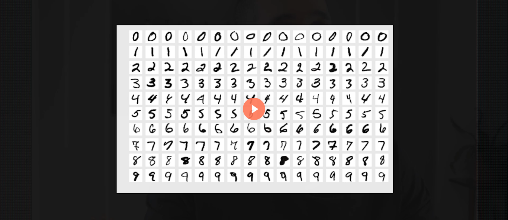
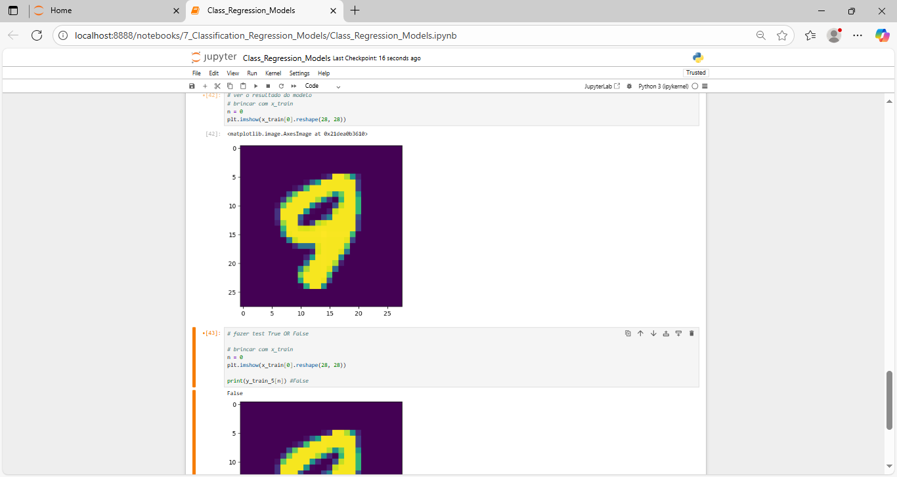
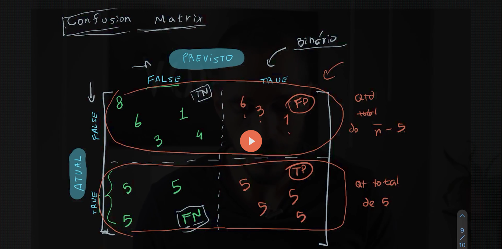

# Classification_Regression_Models
What are classification and regression models in machine learning, how they learn, and how to create them in practice🚀🚀

# 📊 Classification and Regression Models

## 🧠 About the Course

The **Classification and Regression Models** course from **Asimov Academy** is an introduction to **Machine Learning**.

In this course, you will learn how to build models to:
- 📈 Predict e-commerce sales  
- ✍️ Recognize handwritten numbers (MNIST)  
- 📢 Analyze ad performance  
- 🔍 Learn from data and make better decisions  

The course starts with **binary classification** and basic evaluation metrics.  
Then, it explains **multiclass** and **multilabel classification**.  
After that, you learn **linear regression** and **gradient descent**.  
At the end, the course covers **polynomial regression**, **logistic regression**, and **Softmax regression**.

---

## 🎯 Who Is This Course For?

This course is good for:

- 🚀 Beginners in Machine Learning
- 📊 Professionals who want better prediction skills
- 🎓 Data Science students
- 📉 Data analysts
- 💻 Developers who want to use Machine Learning
- 🤖 Technology and AI fans

---

## 📚 What You Will Learn

### 🔎 Classification
- Classification with the **MNIST** dataset
- Binary classification and accuracy
- Important metrics for classification
- Multiclass and multilabel classification
- Logistic regression
- Softmax regression

### 📐 Regression
- Linear regression
- Gradient descent
- Polynomial regression
- Bias and variance balance
- Ridge regression

### 🛠️ Projects
- 📦 **Project:** Linear regression with e-commerce data
- 📢 **Project:** Logistic regression with advertising data

---

## 🧩 Learning Path

This course is part of the learning path:

- **📌 Data Science & Machine Learning**

---

## ✅ Requirements

Before starting this course, you should know:

1. 📊 **Data Analysis with Pandas & SQL**
2. 📐 **Math for Data Analysis**

---

## 🚀 Final Notes

After this course, you will to work with **classification and regression models**.  
You will understand data better and build simple Machine Learning solutions.

-------

--------

### Img projects

## Screenshots

Here are some images showing the layout of the application:

________________________________________

<h4 align="center">Classification_Regression_Models 🥰 🚀</h4>

    <table>
        <tr>
            <td style="width: 50%; text-align: center;">
                
                
Conj_Date_MNIST

            </td>
            <td style="width: 50%; text-align: center;">
                
                
Result_test_train_False

            </td>
        </tr>
    </table>

   
   

________________________________________

    <table>
        <tr>
             <td style="width: 50%; text-align: center;">
                
                
Métricas_essenciais_modelos_classificação_Confusion_Matrix

            </td>
            <td style="width: 50%; text-align: center;">
                
                
Matriz de Confusão

            </td>
        </tr>
    </table>

   
   

  ________________________________________

  
<h4 align="center">Classification_Regression_Models 🥰 🚀</h4>

    <table>
        <tr>
            <td style="width: 50%; text-align: center;">
                
                
Matriz de Confusão Normalizada

            </td>
            <td style="width: 50%; text-align: center;">
                
                
Linear_Regression_grafic com legendas

            </td>
        </tr>
    </table>

   
   

________________________________________

    <table>
        <tr>
             <td style="width: 50%; text-align: center;">
                
                
Regressão Linear_Calc_estrutura_Basic

            </td>
            <td style="width: 50%; text-align: center;">
                
                
Regressão Linear Dados x. Reta Ajustada_grafic

            </td>
        </tr>
    </table>

   
   

  ________________________________________

<h4 align="center">Classification_Regression_Models 🥰 🚀</h4>

    <table>
        <tr>
            <td style="width: 50%; text-align: center;">
                
                
Linear_Regression_Evolução da Regressão Linear por Gradiente Descendente

            </td>
            <td style="width: 50%; text-align: center;">
                
                
Linear_Regression_mudando a taxa de aprendizado_testes

            </td>
        </tr>
    </table>

   
   

________________________________________

    <table>
        <tr>
             <td style="width: 50%; text-align: center;">
                
                
Linear_Regression_Model Regressoes Polinomiais 1_start learning

            </td>
            <td style="width: 50%; text-align: center;">
                
                
Linear_Regression_simular valores bem aleatorios

            </td>
        </tr>
    </table>

   
   

  ----
---
#### Portugues

# 📊 Modelos de Classificação e Regressão

## 🧠 Sobre o Curso

O curso **Modelos de Classificação e Regressão**, da **Asimov Academy**, é uma introdução ao **Machine Learning**.

Neste curso, você vai aprender a criar modelos para:
- 📈 Prever vendas de e-commerce  
- ✍️ Reconhecer números escritos à mão (MNIST)  
- 📢 Analisar o desempenho de anúncios  
- 🔍 Aprender com dados e tomar melhores decisões  

O curso começa com **classificação binária** e métricas básicas.  
Depois, explica **classificação multiclasse** e **multilabel**.  
Em seguida, você aprende **regressão linear** e **gradiente descendente**.  
No final, o curso aborda **regressão polinomial**, **regressão logística** e **regressão Softmax**.

---

## 🎯 Para Quem é Este Curso?

Este curso é indicado para:

- 🚀 Iniciantes em Machine Learning
- 📊 Profissionais que querem melhorar habilidades de previsão
- 🎓 Estudantes de Ciência de Dados
- 📉 Analistas de dados
- 💻 Desenvolvedores que querem usar Machine Learning
- 🤖 Entusiastas de tecnologia e Inteligência Artificial

---

## 📚 O Que Você Vai Aprender

### 🔎 Classificação
- Classificação com o conjunto de dados **MNIST**
- Classificação binária e acurácia
- Métricas importantes para classificação
- Classificação multiclasse e multilabel
- Regressão logística
- Regressão Softmax

### 📐 Regressão
- Regressão linear
- Gradiente descendente
- Regressão polinomial
- Balanço entre viés e variância
- Ridge regression

### 🛠️ Projetos
- 📦 **Projeto:** Regressão linear com dados de e-commerce
- 📢 **Projeto:** Regressão logística com dados de publicidade

---

## 🧩 Trilha de Aprendizado

Este curso faz parte da trilha:

- **📌 Data Science & Machine Learning**

---

## ✅ Pré-requisitos

Antes de iniciar este curso, é recomendado ter conhecimento em:

1. 📊 **Análise de Dados com Pandas & SQL**
2. 📐 **Matemática para Análise de Dados**

---

## 🚀 Considerações Finais

Ao final do curso, estarei preparada para trabalhar com  
**modelos de classificação e regressão** e criar soluções simples  
de Machine Learning baseadas em dados.

---
----

Python: Linguagem principal utilizada para desenvolver o app.

________________________________________
### Python: The main programming language used to build the app.

#### 🤝 Contributing
If you would like to contribute to this project, feel free to open an issue or submit a pull request! 🚀
________________________________________
#### 📜 License
This project is licensed under the MIT License - see the LICENSE file for details.
👩💻 Developed with 💙 by [[LuDiemert](https://www.linkedin.com/in/lucianadiemert/)]

________________________________________
- #### My LinkedIn - 

________________________________________
## 🌐 **Contact**

#### [**Luciana Diemert**](https://github.com/ludiemert)

🛠 Full-Stack Developer  
🖥️ Python | Computer Vision | AI Integrations  
📍 T23 R2RV,  Cork - Irland 
☎ +353 87 243 8690

&nbsp;
&nbsp;
&nbsp;
&nbsp;

 

---
Developed with ❤ by [ludiemert](https://github.com/ludiemert).
